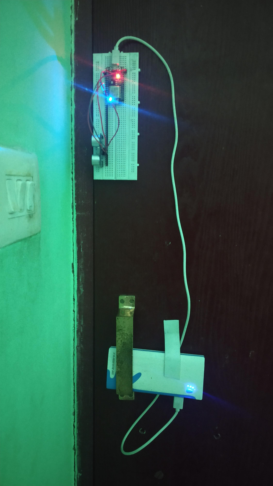

# Door Assistant - a NodeMCU based smart door sensor

The project was aimed to design a NodeMCU controlled door alert system which when turned on through an app automatically senses if the door has been opened and records the data in google firebase and sends an alert notification to the app. Other than simply using it for theft security purpouses, we can use it for child safety purpouses when parents are not at home.

### Features

- Realtime data storage using google firebase
- Sending automatic alert notification to user in his phone 
- Recording the date and time when the door was opened

### Technologies Used

- Nodemcu
- Firebase
- Android app
- Ultrasonic sensor

### Impact

The use cases for this product extends to:

- As a theft alarm when you are not at home
- As a child safety lock when you are not at home to see when your child had gone out and come in from the realtime database in  firebase

### Directions for installation

- Install the app in your phone
- Mount the device in such a way that when the door is closed, there is an obstacle in front of the sensor at a distance of 5 cm
- The NodeMCU must be connected to a WiFi network with internet connection
- To start the sensor click on the on button on the app
- If you see a red light on the NodeMCU, that indicates your sensor has been turned on

Example installation:

[Video of working](https://drive.google.com/file/d/1Czr-MOq_-vULsIv5ZY8cQAZ6UCjFAal0/view?usp=sharing)

### Team

- Contributor - Akash Das
- Mentor - Arya Das